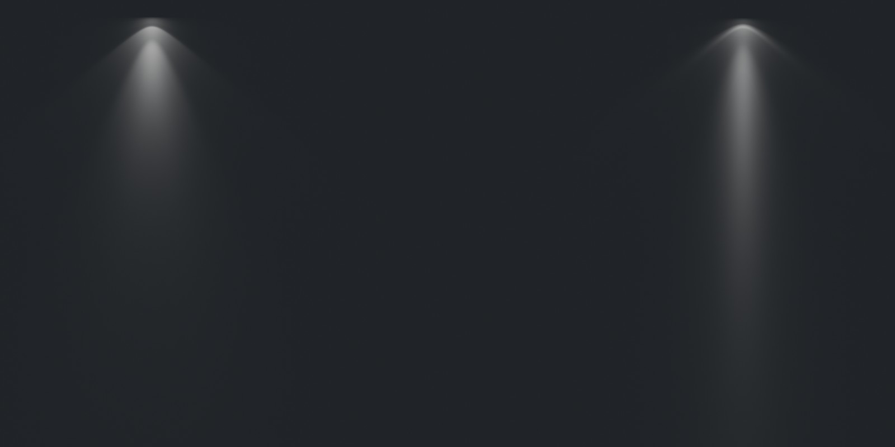
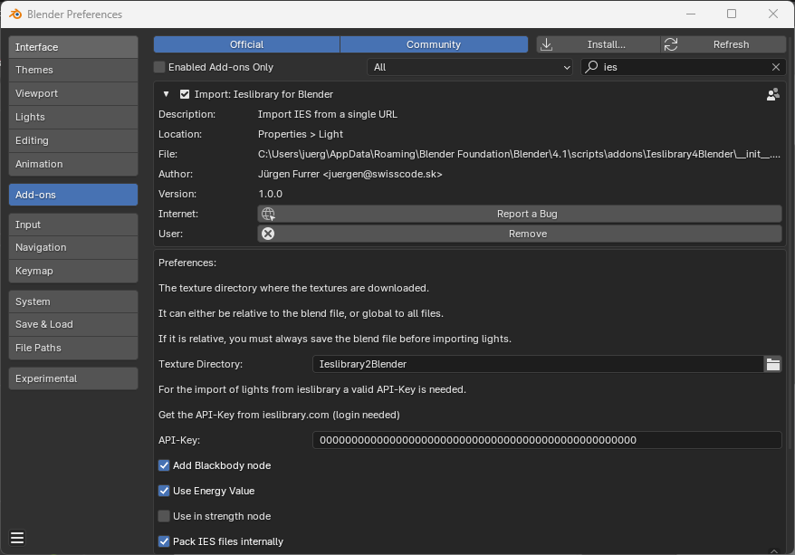
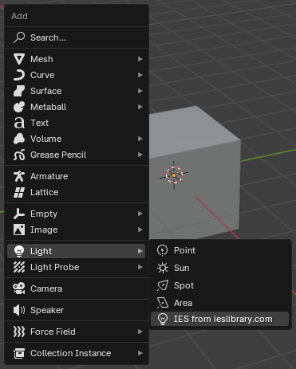
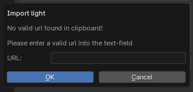
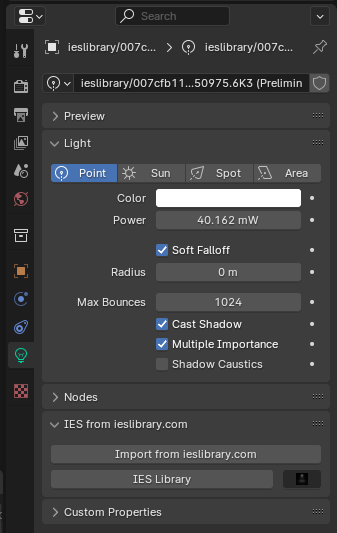
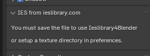

# Ieslibrary4Blender
Blender plugin to find lights from ieslibrary.com

Ieslibrary for Blender
======================

Ieslibrary4Blender is based on LilySurfaceScraper.

With this Addon, you can easily import ies-lights from ieslibrary.com into Blender.

You can simply browse ieslibrary.com as normal, copy the URL and insert a new light.

## Links & Resources

- [Downloads](https://github.com/juergenfurrer/Ieslibrary4Blender/releases)

## Installation

Download the [latest release](https://github.com/juergenfurrer/Ieslibrary4Blender/releases/latest), then in Blender, go to `Edit > Preferences`, `Add-on`, `Install`, browse to the zip file.

Make sure that you have ticked the small checkbox next to "Import: Ieslibrary for Blender", otherwise the add-on will not be active.

Open ieslibrary and got to [Profile > API](https://ieslibrary.com/api) and create a new API-Key.

Be avare, that the API-Key has an expiration-datetime, if you are a free-user, this key will only be valid for 15 minutes a Pro Subscription will last 7 days.

Paste the API-Key from ieslibrary.com into the preferences of the Blender-Addon

### Preferences

You can set a path to your texture library. If the path is in absolute form, like `C:\Users\nik\Pictures`, you will not have to save your blend files before you can use the add-on.

If a path is relative like `image-textures\ies` _Ieslibrary4Blender_ searches for a folder named _image-textures_ next to your .blend project file and saves the textures inside _image-textures_ in a subfolder named _ies_.

## Usage

### Add Menu

1. Shift + a to open the Add-Menu

2. Select `Light > IES from ieslibrary.com`

3. If a valid URL is in the clipboard, a new lamp will be created

If you have selected something else then a point-lamp, a new lamp will be created.

If you dont have a valid ieslibrary.com url in the clipboard, a popup will be opened, where you can enter a valid URL.

### Existing light

1. Open the light properties panel.

2.  If you see this message you need to save your file first or [set an absolute path](#preferences) for your textures.

3. Browse ieslibrary.com until you find a light, like https://ieslibrary.com/browse#ies-00c6ce79e1d2cdf3a1fb491aaaa47ae0
 
4. Copy the URL

5. Click _Import from ieslibrary.com_ to instantly import the light. If there is no valid url in the clipboard a popup will open, where you can enter the URL manually:

6. The ies-file will now being downloaded and the light is being setup. Depending on the resolution and your internet connection this can take a few seconds.

To change where the ies-files are being stored on the drive, check [Preferences](#preferences). Note that they are not downloaded twice if you use the same URL again.

## Troubleshooting

**Blender hangs forever when downloading the files**  
If you are using a VPN, try to disable it.

